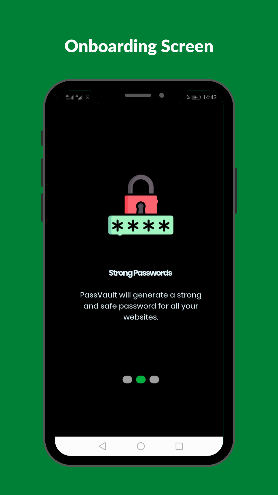
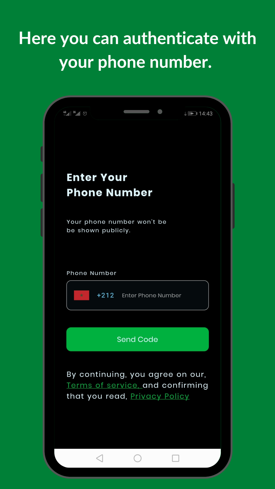
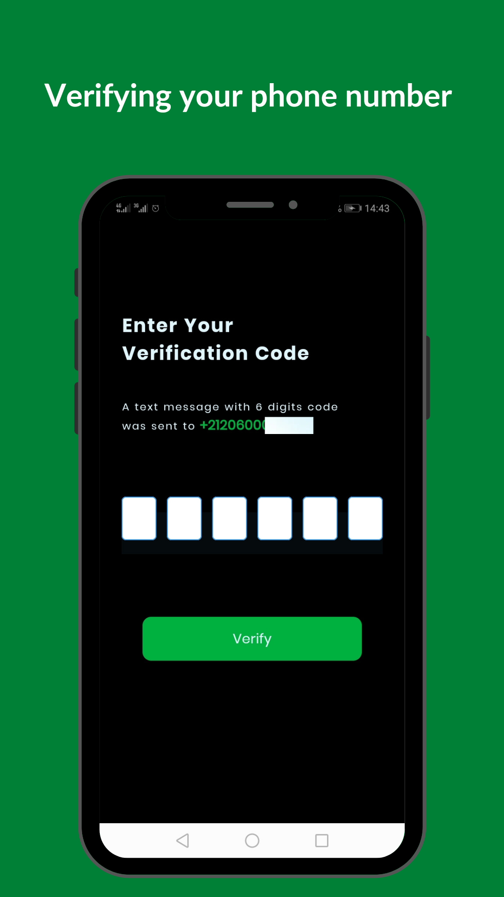
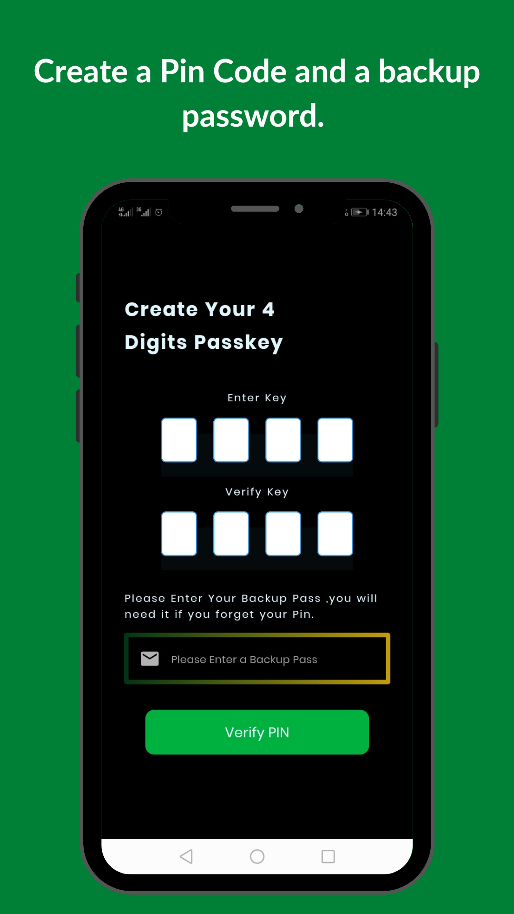
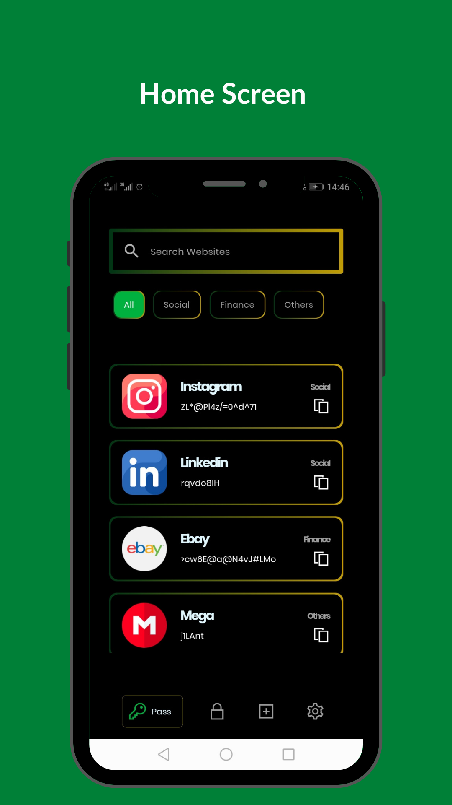
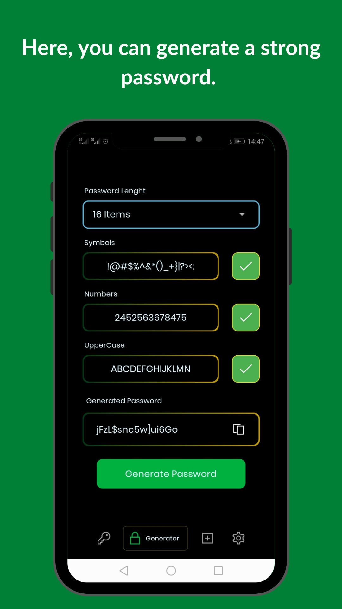
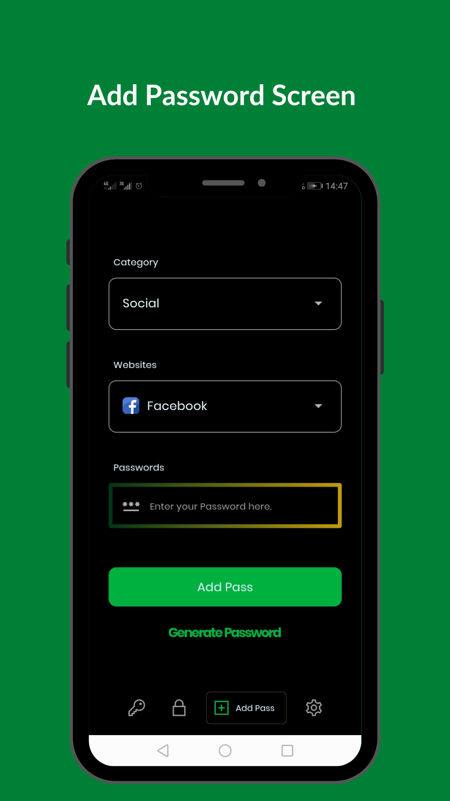
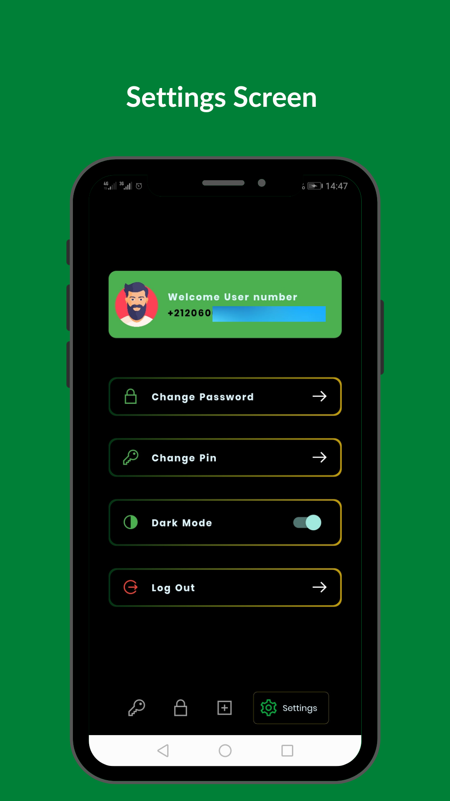
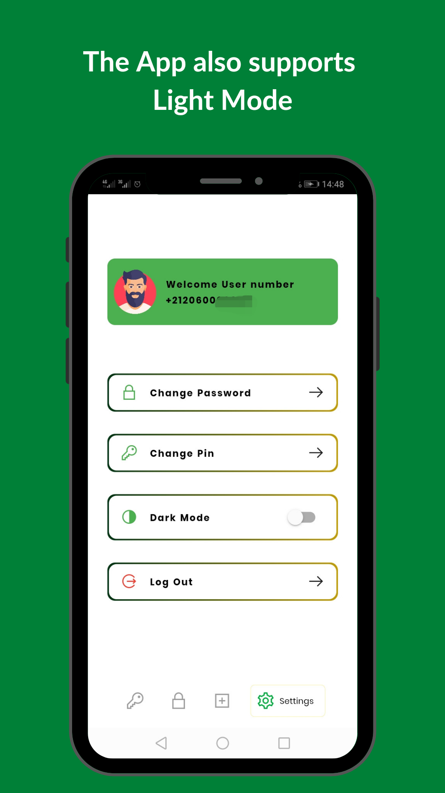

# 🔥 Password Vault

An App To manage all your passwords and generate new ones. It is built with firebase backend.

Star⭐ the repo if you like what you see😉.

## ✨ Features :
- Auth with phone number.
- Pin/BackUp Code.
- Search Websites.
- Website Categories.
- Beautiful UI.
- Beautiful Animation.
- Dark/Light Mode.

## 📸 Screenshots :

        

**=> Icons made by Freepik from [FlatIcons](https://www.flaticon.com/authors/ruslan-babkin)**

**=> The UI is inspired from [Jerahmeel Madu](https://www.behance.net/gallery/125013381/PassPro-UI?tracking_source=search_projects%7Cpassword%20app%20ui)**

